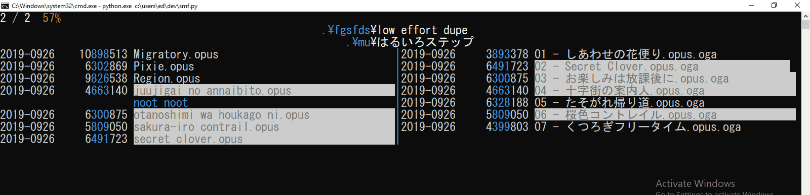

# size-match folders
*aka `shotgun meets folder` aka `shit, my files` aka `simplema`--wait no not that*

this compares folders based on the size of the files inside
* works on any filetype (buut does multimedia best)
* doesn't care about filenames
* and it never opens a single file

it sounds too naive to work but it actually does, really well even, so don't knock it until you lose all your files with it! (dw it doesn't even have a delete feature yet, jjust scanning and browsing)

run the script, preferably with pypy which reduces the initial scan from 40sec to 2.6sec (seriously), then
* use W/S to navigate through the folders it thinks are dupes
* press E to open an actual file explorer at those two folders
* press U to toss the cache
* press Q to toggle view *(not yet, that's a spoiler)*
* duplicate files are hilighted in white
* folders are blue
* symlinks are yellow
* anything else red

the following filters are applied to remove most false positives:
* more than two files in each folder
* total of 1MB+ in each folder
* 20%+ of the files must have identical size across folders
* folders must be within 30% total size difference
* the files with matching sizes must must amount to 20%+ of the folder

it deals moderately well with moonrunes, using absolute cursor positioning to avoid having to consider glyph widths (nice)

also you might think that this is windows compatible due to all the msvcrt/mbcs/`hhhhHhhhhh` stuff, and that is absolutely correct:
* use python3 (unless you only have ascii filenames)
* use the regular new win10 terminal, powershell is a meme
* optionally change font to `MS Gothic` to further enable moonrunes
* the ranger hotkey was substituted with two explorer windows, please change this if you have a better idea

